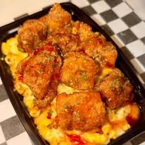

# WhatsOnTheMenuKC

Official website for **What's on the Menu KC** — a Kansas City pop-up kitchen serving fresh comfort food plates, Hibachi Nights, and family meals across the KC metro area.

---

## 🔥 Live Site

> Coming soon — hosted via GitHub Pages

---

## 📋 Project Overview

| Detail | Info |
|---|---|
| **Client** | What's on the Menu KC |
| **Instagram** | [@whatsonthemenukc](https://www.instagram.com/whatsonthemenukc) |
| **Phone** | (816) 409-9735 |
| **Built By** | CMB Enterprise Group LLC |
| **Launched** | 2026 |
| **Hosting** | GitHub Pages (free) |

---

## 🗂️ File Structure

```
WhatsOnTheMenuKC/
│
├── index.html        ← Main website file (edit menu & specials here)
├── README.md         ← You're reading this
│
└── images/
    ├── food1.jpg
    ├── food2.jpg
    ├── food3.jpg
    ├── food4.jpg
    ├── food5.jpg
    ├── food6.jpg
    ├── food7.jpg
    └── food8.jpg
```

---

## ✏️ How to Update the Website

All menu items, prices, specials, and schedule info are located **near the top of `index.html`** in clearly labeled sections. No design knowledge needed.

### To update from GitHub (no tech skills required):

1. Go to the repo on GitHub
2. Click on **`index.html`**
3. Click the **pencil icon** (Edit this file) in the top right
4. Find the section you want to change (look for the comments like `<!-- MENU ITEMS -->`)
5. Make your edits
6. Scroll down and click **"Commit changes"**
7. Your site updates within 1–2 minutes ✅

---

## 🍽️ What's on the Site

- **Hero section** — Brand intro with call-to-action buttons
- **Photo strip** — Food photography gallery strip
- **About section** — Story and key stats
- **Menu (tabbed)** — Three menus: Dinner Plates, Hibachi Nights, Weekend Menu
- **Specials section** — Current limited-time offers
- **Full gallery** — Food photo grid
- **Order section** — Text-to-order, Cash App, Instagram, payment methods
- **Footer** — Navigation + branding

---

## 🖼️ Adding New Food Photos

1. Name the photo `food9.jpg` (or the next available number)
2. Upload it to the `images/` folder on GitHub
3. In `index.html`, find the gallery section and add:

```html
<div class="gi">
  
  <div class="gi-ov"><span>Dish Name</span></div>
</div>
```

---

## 🎨 Design Details

| Element | Value |
|---|---|
| **Color Palette** | Smoky Southern — Brick Red, Warm Gold, Espresso Brown, Cream |
| **Primary Font** | Abril Fatface (headings) |
| **Body Font** | Barlow Semi Condensed |
| **Accent Font** | Lora (italic descriptions) |
| **Background Style** | Dark hero + light menu sections |
| **Hosted On** | GitHub Pages |

---

## 📦 Updating Pricing

Find any price in `index.html` and update the number. Prices appear like this:

```html
<span class="mi-p">$15</span>
```

Just change the number between the tags. Example: `$15` → `$18`

---

## 📅 Updating the Pop-Up Schedule

Find the schedule inside the hero badges or the specials section and update the days, times, and locations directly in the HTML text.

---

## 📞 Contact & Support

For website updates, changes, or questions:

**CMB Enterprise Group LLC**
- Built and maintained by Carla Bee
- Email: *(your email here)*
- Phone: *(your number here)*

---

## ⚠️ Notes

- Do **not** delete the `images/` folder — it contains all food photos used on the site
- Do **not** edit the `<style>` section unless you know CSS
- Always preview changes by visiting the live GitHub Pages URL after committing
- If something breaks, contact CMB Enterprise Group LLC for support

---

*Website designed and developed by [CMB Enterprise Group LLC](https://github.com/CmbDigitalStudio) · 2026*
